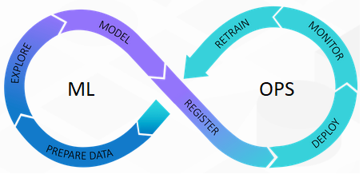

# Awesome MLOPS
A curated list of resources, tools, frameworks, articles, and projects related to Machine Learning Operations (MLOps).

  

## Table of Contents

- [Awesome MLOPS](#awesome-mlops)
  - [Table of Contents](#table-of-contents)
  - [Introduction](#introduction)
  - [Roadmaps](#roadmaps)
  - [One Video](#one-video)
  - [Playlists](#playlists)
  - [Youtube channels](#youtube-channels)
  - [Linkedin Accounts](#linkedin-accounts)
  - [Books](#books)
  - [Blogs](#blogs)
  - [Free Courses](#free-courses)
  - [Paid Courses](#paid-courses)
  - [Communities](#communities)
  - [Projects](#projects)
  - [Tools](#tools)
  - [Contributing](#contributing)

## Introduction

Welcome to Awesome MLOps! This repository aims to gather the best resources related to MLOps, covering a wide range of topics including best practices, tools, frameworks, articles, and projects in the field of Machine Learning Operations.

- [What is MLOps? | AWS](https://aws.amazon.com/what-is/mlops/)
- [What is MLOps? | Nvidia](https://blogs.nvidia.com/blog/what-is-mlops/)
- [What is MLOps? | Ubuntu](https://ubuntu.com/blog/what-is-mlops)
- [Why Should You Use MLOps? | AWS](https://docs.aws.amazon.com/sagemaker/latest/dg/sagemaker-projects-why.html)
- [Introduction to MLOps](https://blog.paperspace.com/introduction-to-mlops/)
- [MLOps and the evolution of data science | IBM](https://www.ibm.com/blog/mlops-and-the-evolution-of-data-science/)
- [MLOps: Enabling Operationalization of ML at Scale](https://www.iguazio.com/mlops/)

## Roadmaps

- [Complete RoadMap To Learn AIOPS or MLOPS](https://www.youtube.com/watch?v=f8AtpzmRzFc)
- [MLOps Roadmap | Secure Top Jobs Instantly](https://www.youtube.com/watch?v=RebzueX3Ih8)
- [MLOps Roadmap 2024 | MLOps Career Path 2024 | MLOps Careers | Simplilearn](https://www.youtube.com/watch?v=xP_OPVt0Mr0)
- [MLOps Explained | MLOps Roadmap | Future of Data & AI](https://www.youtube.com/watch?v=1JRcYSoyp8E)
- [What is MLOps and how to get started? | MLOps series](https://www.youtube.com/watch?v=LdLFJUlPa4Y)

## One Video

- [MLOps Full Course | MLOps Tutorial For Beginners | Machine Learning Operations | Intellipaat](https://www.youtube.com/watch?v=0Z0vZU6cMKY&t=1s)
- [MLOps Course – Build Machine Learning Production Grade Projects](https://www.youtube.com/watch?v=-dJPoLm_gtE)
- [MLOps Roadmap 2024 | MLOps Career Path 2024 | MLOps Careers | Simplilearn](https://www.youtube.com/watch?v=xP_OPVt0Mr0)
- [Enterprise MLOps 101 | Nvidia](https://www.nvidia.com/en-us/on-demand/session/gtcspring23-s51616/)
- [Best Practices to Accelerate ML Workflows and Reduce Computational Debt with MLOps | Nvidia](https://www.nvidia.com/en-us/on-demand/session/gtcfall20-a22204/)
- [Introduction to Machine Learning Operations | Ubuntu](https://www.youtube.com/watch?v=_YjqHJNNnKE)

## Playlists

- [Machine Learning Engineering for Production (MLOps)](https://www.youtube.com/playlist?list=PLkDaE6sCZn6GMoA0wbpJLi3t34Gd8l0aK)
- [MLOps Zoomcamp 2022](https://www.youtube.com/playlist?list=PL3MmuxUbc_hLG1MoGNxJ9DmQSSM2bEdQT)
- [MLOps Tutorials DVCorg](https://www.youtube.com/playlist?list=PL7WG7YrwYcnDBDuCkFbcyjnZQrdskFsBz)
- [MLOps Hands On Implementation](https://www.youtube.com/playlist?list=PLwFaZuSL_mfou923msxLWAqxkj6Zcnt29)
- [MLOPS Krish Naik](https://www.youtube.com/playlist?list=PLZoTAELRMXVOk1pRcOCaG5xtXxgMalpIe)
- [MLOps - Machine Learning Operations](https://www.youtube.com/playlist?list=PL3N9eeOlCrP5a6OA473MA4KnOXWnUyV_J)
- [Azure MLOps - DevOps for Machine Learning MG](https://www.youtube.com/playlist?list=PLiQS6N-W1p3m9squzZ2cPgGdH5SBhjY6f)

## Youtube channels 

- [MLOpscommunity](https://www.youtube.com/c/MLOpscommunity)
- [Krish Naik](https://www.youtube.com/@krishnaik06)
- [DSwithBappy](https://www.youtube.com/@dswithbappy)
- [MLOps World: Machine Learning in Production](https://www.youtube.com/@mlopsworldmachinelearningi9769)
- [MLOps Learners](https://www.youtube.com/@mlopslearners)
- [DataTalksClub](https://www.youtube.com/@DataTalksClub/videos)
- [AiOps & MLOps School](https://www.youtube.com/@theaiops)
- [Miki Bazeley - The MLOps Engineer](https://www.youtube.com/@Miki_ML)
- [Sokratis Kartakis](https://www.youtube.com/@sokratis.kartakis/videos)
- [MLOps London](https://www.youtube.com/@mlopslondon)

## Linkedin Accounts 
- [Noah Gift](https://www.linkedin.com/in/noahgift/)
- [Youssef Hosni](https://www.linkedin.com/in/youssef-hosni-b2960b135/)
- [Mohammad Oghli](https://www.linkedin.com/in/mohammad-oghli/)
- [Rahul Parundekar](https://www.linkedin.com/in/rparundekar/)
- [MLOps Newsletter](https://www.linkedin.com/newsletters/mlops-newsletter-6968165653283266560/)
- [Paul Iusztin](https://www.linkedin.com/in/pauliusztin/)
- [Himanshu Ramchandani](https://www.linkedin.com/in/hemansnation/)
- [Khuyen Tran](https://www.linkedin.com/in/khuyen-tran-1401/)
- [MLOps Community](https://www.linkedin.com/company/mlopscommunity/)
- [Raphaël Hoogvliets](https://www.linkedin.com/in/hoogvliets/)
- [Patricia Kato](https://www.linkedin.com/in/patriciakato/)
- [Hugo Albuquerque](https://www.linkedin.com/in/hugo-albuquerque-cosme-da-silva/)

## Books
- [What Is MLOps?](https://www.oreilly.com/library/view/what-is-mlops/9781492093626/)
- [Reliable Machine Learning](https://www.oreilly.com/library/view/reliable-machine-learning/9781098106218/)
- [Designing Machine Learning Systems](https://www.oreilly.com/library/view/designing-machine-learning/9781098107956/)
- [Implementing MLOps in the Enterprise](https://www.oreilly.com/library/view/implementing-mlops-in/9781098136574/?_gl=1*ev4ki1*_ga*NzU5Nzc0MzUuMTcwMTUwNjM0MQ..*_ga_092EL089CH*MTcwMTgwNzMxMy4zLjEuMTcwMTgwNzQ1OS41Ni4wLjA.)
- [MLOps Engineering at Scale](https://www.oreilly.com/library/view/mlops-engineering-at/9781617297762/?_gl=1*ev4ki1*_ga*NzU5Nzc0MzUuMTcwMTUwNjM0MQ..*_ga_092EL089CH*MTcwMTgwNzMxMy4zLjEuMTcwMTgwNzQ1OS41Ni4wLjA.)
- [Engineering MLOps](https://www.oreilly.com/library/view/engineering-mlops/9781800562882/?_gl=1*dmg820*_ga*NzU5Nzc0MzUuMTcwMTUwNjM0MQ..*_ga_092EL089CH*MTcwMTgwNzMxMy4zLjEuMTcwMTgwNzUzNy42MC4wLjA.)
- [Enterprise MLOps Interviews](https://www.oreilly.com/library/view/enterprise-mlops-interviews/08012022VIDEOPAIML/?_gl=1*19w4nom*_ga*NzU5Nzc0MzUuMTcwMTUwNjM0MQ..*_ga_092EL089CH*MTcwMTgwNzMxMy4zLjEuMTcwMTgwNzU0MS42MC4wLjA.)
- [Introducing MLOps: How to Scale Machine Learning in the Enterprise](https://www.amazon.com/Introducing-MLOps-Machine-Learning-Enterprise/dp/1492083291/)

## Blogs
- [Practitioners guide to MLOps | Google](https://services.google.com/fh/files/misc/practitioners_guide_to_mlops_whitepaper.pdf)
- [ML Models Containerization using Docker](https://www.linkedin.com/pulse/ml-models-containerizing-using-docker-mlops-mohammad-oghli-9ss7f/)
- [A guide to MLOps | Ubuntu Whitepaper](https://ubuntu.com/engage/mlops-guide)
- [MLOps Toolkit Explained | Ubuntu Whitepaper](https://ubuntu.com/engage/mlops-toolkit)
- [Google Cloud Platform with ML Pipeline: A Step-to-Step Guide](https://www.analyticsvidhya.com/blog/2022/01/google-cloud-platform/)
- [What is MLflow?](https://canonical.com/blog/what-is-mlflow)
- [Building a comprehensive toolkit for machine learning](https://canonical.com/blog/machine-learning-toolkit)
- [Made With ML](https://madewithml.com)
- [Mlops Community](https://mlops.community/blog/)
- [Valohai](https://valohai.com/blog/)
- [Evidentlyai](https://www.evidentlyai.com/category/mlops)
- [MLOps.community Medium](https://medium.com/mlops-community)
- [The MLOps Blog](https://neptune.ai/blog)
- [DagsHub MLOps](https://dagshub.com/blog/tag/mlops/)
- [Polyaxon](https://polyaxon.com/blog/)
- [360digitmg](https://360digitmg.com/blog-category/mlops)
- [Nimblebox](https://blog.nimblebox.ai)
- [Fiddler](https://www.fiddler.ai/blog-categories/mlops)
- [Nvidia](https://developer.nvidia.com/blog/tag/mlops/)
- [Censius](https://censius.ai/blogs)
- [Arrikto’s MLOps and Kubeflow Blog](https://journal.arrikto.com)
- [ZenML Blog](https://www.zenml.io/blog)
- [Mlops Now](https://mlopsnow.com/blog/)
- [Data Tron](https://datatron.com/blog/)

## Free Courses 

- [MLOps Specialization by DeepLearning.AI](https://www.coursera.org/specializations/machine-learning-engineering-for-production-mlops)
- [MLOps | Machine Learning Operations Specialization](https://www.coursera.org/specializations/mlops-machine-learning-duke)
- [MLOps Fundamentals by Google Cloud](https://www.coursera.org/learn/mlops-fundamentals?irclickid=xXASI9XEfxyIUUY36z15iWZRUkD2gAyoZ2m5Rg0&irgwc=1&utm_medium=partners&utm_source=impact&utm_campaign=2382270&utm_content=b2c)
- [Effective MLOps: Model Development](https://www.wandb.courses/courses/effective-mlops-model-development)
- [MLOps Fundamentals](https://www.mygreatlearning.com/academy/learn-for-free/courses/mlops-fundamentals)
- [MLOps1 (AWS)](https://www.edx.org/learn/amazon-web-services-aws/statistics-com-mlops1-aws-deploying-ai-ml-models-in-production-using-amazon-web-services)
- [MLOps2 (AWS)](https://www.edx.org/learn/amazon-web-services-aws/statistics-com-mlops2-aws-data-pipeline-automation-optimization-using-amazon-web-services)
- [MLOps Concepts](https://www.datacamp.com/courses/mlops-concepts)
- [MLOps Deployment and Life Cycling](https://www.datacamp.com/courses/mlops-deployment-and-life-cycling)

## Paid Courses 

- [Learn MLOps for Machine Learning](https://www.oreilly.com/library/view/learn-mlops-for/9780138204785/?_gl=1*nmfsia*_ga*NzU5Nzc0MzUuMTcwMTUwNjM0MQ..*_ga_092EL089CH*MTcwMTgwNzMxMy4zLjEuMTcwMTgwNzUzNy42MC4wLjA.)
- [Introduction to MLflow for MLOps](https://www.oreilly.com/library/view/introduction-to-mlflow/28188975VIDEOPAIML/?_gl=1*1mbqd7v*_ga*NzU5Nzc0MzUuMTcwMTUwNjM0MQ..*_ga_092EL089CH*MTcwMTgwNzMxMy4zLjEuMTcwMTgwNzU0OC41My4wLjA.)
- [Hands-on Python for MLOps](https://www.oreilly.com/library/view/hands-on-python-for/28188920VIDEOPAIML/?_gl=1*11ahkm4*_ga*NzU5Nzc0MzUuMTcwMTUwNjM0MQ..*_ga_092EL089CH*MTcwMTgwNzMxMy4zLjEuMTcwMTgwNzU2My4zOC4wLjA.)
- [Hugging Face for MLOps](https://www.oreilly.com/library/view/hugging-face-for/28189144VIDEOPAIML/?_gl=1*1mbqd7v*_ga*NzU5Nzc0MzUuMTcwMTUwNjM0MQ..*_ga_092EL089CH*MTcwMTgwNzMxMy4zLjEuMTcwMTgwNzU0OC41My4wLjA.)
- [Doing MLOps with Databricks and MLFlow - Full Course](https://www.oreilly.com/library/view/doing-mlops-with/062592022VIDEOPAIML/?_gl=1*1mbqd7v*_ga*NzU5Nzc0MzUuMTcwMTUwNjM0MQ..*_ga_092EL089CH*MTcwMTgwNzMxMy4zLjEuMTcwMTgwNzU0OC41My4wLjA.)
- [Master Practical MLOps for Data Scientists & DevOps on AWS](https://www.udemy.com/course/practical-mlops-for-data-scientists-devops-engineers-aws/)
- [MLflow in Action - Master the art of MLOps using MLflow tool](https://www.udemy.com/course/mlflow-course/)
- [Azure Machine Learning & MLOps : Beginner to Advance](https://www.udemy.com/course/azure-machine-learning-mlops-mg/)
- [Deployment of Machine Learning Models](https://www.udemy.com/course/deployment-of-machine-learning-models/)
- [Mastering MLOps: Complete course for ML Operations](https://www.udemy.com/course/mastering-mlops-complete-course-for-ml-operations/)

## Communities

- [MLOps.community on Slack](https://mlops.community)
- [CDF Special Interest Group – MLOps]()

## Projects

- [End To End MLOPS Data Science Project Implementation With Deployment](https://www.youtube.com/watch?v=pxk1Fr33-L4)
- [Best MLOps Practices for Building End-to-End Machine Learning Computer Vision Projects with Alex Kim](https://www.youtube.com/watch?v=E26IaD7bNXg)
- [End To End Deep Learning Project Using MLOPS DVC Pipeline With Deployments Azure And AWS- Krish Naik](https://www.youtube.com/watch?v=p1bfK8ZJgkE)
- [End To End Machine Learning Project Implementation With Dockers,Github Actions And Deployment](https://www.youtube.com/watch?v=MJ1vWb1rGwM)
- [MLOps with Azure - Hands on Session](https://www.youtube.com/watch?v=pLd7xF0z5Zs)
- [MLOPS End To End Implementation From Basics- Machine Learning](https://www.youtube.com/watch?v=n4sz9cG_B7k)
- [Complete End to End Deep Learning Project With MLFLOW,DVC And Deployment](https://www.youtube.com/watch?v=86BKEv0X2xU)
- [Introduction To MLflow | Track Your Machine Learning Experiments | MLOps](https://www.youtube.com/watch?v=ksYIVDue8ak)
- [MLOPs Projects](https://www.youtube.com/watch?v=esqFvJp8fac)
- [MLOPS-Machine Learning Production Grade Deployment Technqiues With MLOPS In One Shot](https://www.youtube.com/watch?v=lDWUJiivMX8)
- [End to end Deep Learning Project Implementation using MLOps Tool MLflow & DVC with CICD Deployment](https://www.youtube.com/watch?v=-NOIWzjJK-4)
- [BentoML | Build Production Grade AI Applications | MLOps](https://www.youtube.com/watch?v=TWMIFi_ON1M)
- [Build CI/CD Pipelines for ML Projects with Azure Devops](https://www.youtube.com/watch?v=xbgMqCuWgzs)
- [MLOPS - Running Successful AI Projects in Production](https://www.youtube.com/watch?v=C79Ut0fVDSY)
- [End-to-End MLOps Project using one component on Azure](https://www.youtube.com/watch?v=Lpi6d-MgJVI)
- [MLOps Tutorial - Building a CI/ CD Machine Learning Pipeline](https://www.youtube.com/watch?v=XoXvX8MyW8M)

## Tools

- [mlflow](https://mlflow.org) - helps you manage core parts of the machine learning lifecycle.
- [dagshub](https://dagshub.com) - a platform made for the machine learning community to track and version the data, models, experiments, ML pipelines, and code
- [docker](https://www.docker.com) - an open platform for developing, shipping, and running applications
- [zenml](https://www.zenml.io) - helps you create MLOps pipelines without the infrastructure complexity
- [Amazon SageMaker](https://aws.amazon.com/pm/sagemaker/?gclid=Cj0KCQiAsburBhCIARIsAExmsu7H_9sFi10FGKt5u_dHd73wamt7EIJWWu0FBo1Q7HygmyYZBLwGTPYaAhQxEALw_wcB&trk=b9fddfb8-9b30-4c54-8f91-ff16fad4dfed&sc_channel=ps&ef_id=Cj0KCQiAsburBhCIARIsAExmsu7H_9sFi10FGKt5u_dHd73wamt7EIJWWu0FBo1Q7HygmyYZBLwGTPYaAhQxEALw_wcB:G:s&s_kwcid=AL!4422!3!645208943671!e!!g!!amazon%20sagemaker!19572078909!144705028745) - one solution for MLOps. You can train and accelerate model development, track and version experiments, catalog ML artifacts, integrate CI/CD ML pipelines, and deploy, serve, and monitor models in production seamlessly.
- [comet](https://www.comet.com/site/) - a platform for tracking, comparing, explaining, and optimizing machine learning models and experiments
- [Weights & Biases](https://wandb.ai/site) - an ML platform for experiment tracking, data and model versioning, hyperparameter optimization, and model management.
- [prefect](https://www.prefect.io) - a modern data stack for monitoring, coordinating, and orchestrating workflows between and across applications
- [metaflow](https://metaflow.org) - a powerful, battle-hardened workflow management tool for data science and machine learning projects
- [kedro](https://kedro.org) -  a workflow orchestration tool based on Python. You can use it for creating reproducible, maintainable, and modular data science projects
- [pachyderm](https://www.pachyderm.com) - automates data transformation with data versioning, lineage, and end-to-end pipelines on Kubernetes.
- [dvc](https://dvc.org) - an open-source tool for machine learning projects. It works seamlessly with Git to provide you with code, data, model, metadata, and pipeline versioning. 
- [bentoml](https://www.bentoml.com) - makes it easy and faster to ship machine learning applications
- [evidentlyai](https://www.evidentlyai.com) - an open-source Python library for monitoring ML models during development, validation, and in production
- [fiddler](https://www.fiddler.ai) - an ML model monitoring tool with an easy-to-use, clear UI.
- [censius](https://censius.ai) - an end-to-end AI observability platform that offers automatic monitoring and proactive troubleshooting.
- [kubeflow](https://www.kubeflow.org/docs/) - makes machine learning model deployment on Kubernetes simple, portable, and scalable
- [qwak](https://www.qwak.com) - fully-managed, accessible, and reliable ML platform to develop and deploy models and monitor the entire machine learning pipeline
- [datarobot](https://www.datarobot.com/platform/mlops/) - offers features such as automated model deployment, monitoring, and governance
- [valohai](https://valohai.com/product/) - provides a collaborative environment for managing and automating machine learning projects.
- [aimstack](https://aimstack.io) - an open-source AI metadata tracking tool designed to handle thousands of tracked metadata sequences
- [tecton](https://www.tecton.ai/feature-store/) - a feature platform designed to manage the end-to-end lifecycle of features
- [feast](https://github.com/feast-dev/feast) - an open-source feature store with a centralized and scalable platform for managing, serving, and discovering features in MLOps workflows
- [Paperspace](https://www.paperspace.com/artificial-intelligence) - a platform for building and scaling AI applications
- [Charmed Kubeflow](https://charmed-kubeflow.io/) - The fully supported MLOps platform for any cloud

## Contributing

Contributions are welcome! If you have resources, tools, frameworks, articles, or projects related to MLOps that you'd like to add, please open a pull request.

